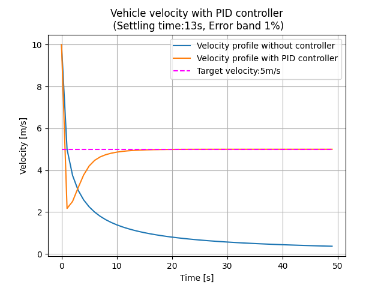
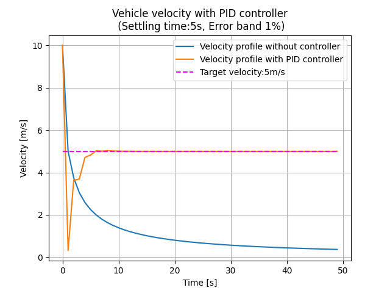
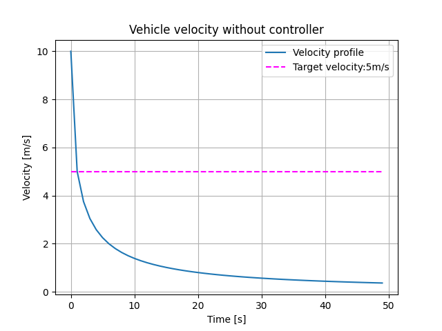
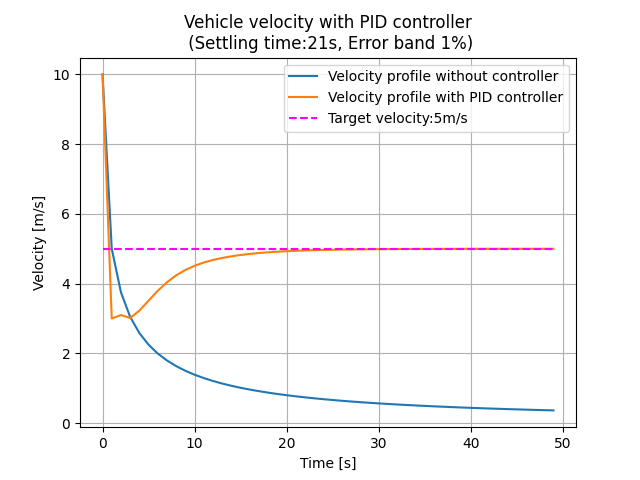
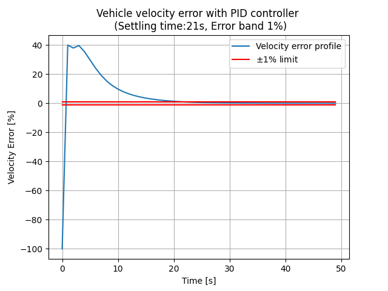
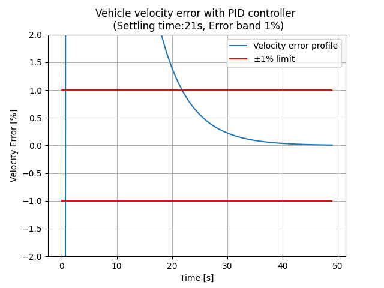
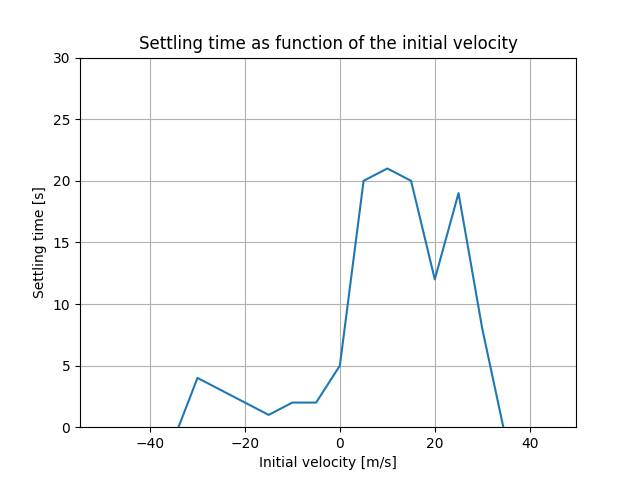
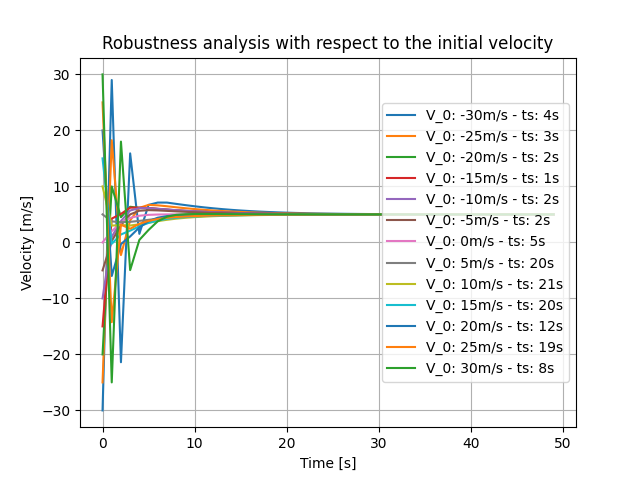

# Vehicle Control Problem (Python)
## Description
### Problem statement

Consider the following one-dimensional problem:
You have a 1 kg vehicle with an initial velocity of 10 m/s, subject to a force which is a function of its velocity:

$f [N]: -sign(velocity\_mps) * k\_kgpm * (velocity\_mps)^2$ 

with $k\_kgpm = 0.05 [kg/m]$.

Sampling time is 1s.

1. Plot the velocity as a function of time
2. Apply a PID controller to fix the speed to 5 m/s with a 1% error under 30s. Plot the result.
3. Explain how you selected the gains. Are these robust with respect changes in the initial velocity
 
### Approaching the problem

Given the force $f$ counteracting the motion of the vehicle, the velocity of the vehicle for the next time step when no controller is active can be calculated as:

$v_{k+1} = v_k + \frac{f}{m} \Delta t$ 

The controller can be thought as an external force $F_c$ applied to the vehicle that either accelerates it or slows it down depending on the controllers output. Then, when the controller is active, the equation of motion can be written as:

$v_{k+1} = v_k + (\frac{F_c}{m} + \frac{f}{m})  \Delta t$ 

### PID Controller
The implementation of a discrete PID controller is:

$u_k=K_p\cdot e_k + K_i \cdot \sum e_k + K_d \cdot \frac{(e_k-e_{k-1})}{\Delta t}$.

where $K_p$, $K_i$, and $K_d$ are the PID gains, $\Delta t$ is the sampling time and $e_k$ is the error value at instant $k$.

To obtain a rough estimation of the PID gains, I used Ziegler-Nicholson method:

1. First, set integral and derivative gains to zero, and increase $K_p$ until I see the response oscillate. This value defines the ultimate gaine $K_u$.
2. Proposed PI controller as I am looking for a response with no steady-state error. This was achieved with $K_u$=0.8. Therefore, according to the method, define:

$K_p=0.45K_u=0.36$; $K_i=0.54K_u/T_u=0.206$; $K_d=0$

Where $T_u$ is the oscillation period measured when $K_p$=$K_u$, which was ~2.1s.

See below the results obtained for a PI and a PID controller using Zieger-Nicholson method:

**PI Controller** :



**PID Controller** :



3. The system's response was fine tuned around this value to reduce overshoot.
   
### Code structure

The [main](main.py) script sets up the complete environment.

#### Classes

Three classes were defined:

* [Vehicle](modules\vehicle.py): Containing all information about a vehicle and the friction forces acting on it.
* [Controller](modules\controller.py): Defined as an abstract class to serve as template/interface for future implementations of different controllers.
  * **PID_Discrete_Controller**: Implements the PID controller.
  * **No_Controller**: Used to simulate that the vehicle has no controller active.
* [Simulation](modules\simulation.py): Object to create a scenario with the vehicle, controllers and run the simulation.

## Usage
### Setup virtual environment
1. If required, create virtual environment by runnning from root:
```bash
./create_env.sh
```
This will install all libraries required to run the code.

1. Activate the environment 
```bash
source venv/Scripts/activate
```

1. To deactivate the virtual environment run:
```bash
deactivate
```
### Executing the code
Run the main.py file by executing the following script from the root folder:
```bash
python main.py
```
or 
```bash
python3 main.py
```
Depending on your python configuration.

### Output
1. After running the code, you should see the next output for the velocity profile of the Vehicle prior to the controller implementation:


1. When the PID controller is activated, the output is: 
   


and the error profile expressed as percentage is:





From where it can be seen that the error is bounded to $\pm 1\%$

### Robustness analysis

To evaluate the robustness of the controller when the vehicle has different starting velocities, I simulated cases changing starting velocity from -50m/s to 50m/s and verify if the vechicle could achieve its target velocity. It was found that the system remains stable within the range: [-30, 30] m/s as shown below:






### Code testing
Some unit tests were included in the __test/__ directory. To run the test, execute from the root directory:
```bash
pytest test/test_pid_controller.py
```
to test the PID Controller implementation, or 
```bash
pytest test/test_no_controller.py
```
to test the No_Controller implementation, or
```bash
pytest test/test_vehicle.py
```
to test the Vehicle Class, or 
```bash
pytest test/test_simulation.py
```
to test the Simulation Class.


## Additional notes
The code was tested on Python3.11.
